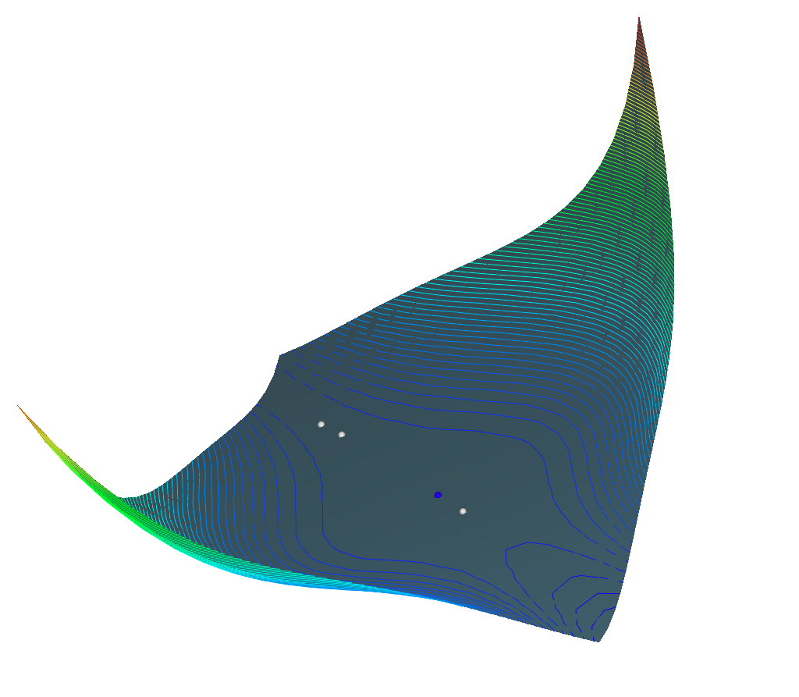

# Project 2  
Scientific Visualizations  
Charles Ison  
10/20/2022

1. a.) 

$$\nabla f(x, y) = 
\begin{pmatrix}
\frac{\partial f}{\partial x} \\
\frac{\partial f}{\partial y}
\end{pmatrix} =
\begin{pmatrix}
\ 3x^2 - 12xy + 3y^2 - 3 \\
\ -6x^2 + 6xy - 3y^2 + 3
\end{pmatrix}
$$

 

$$\texttt{Get critical points by setting both partial derivates equal to zero and solving: }$$ 

$$ 3(x^2 - 4xy + y^2 - 1) = 0 \texttt{ and } -3(2x^2 - 2xy + y^2 - 1) = 0 $$

 

$$\texttt{Critical Points: }$$

$$ (0, -1), \texttt{ } (0, 1), \texttt{ } (\frac{-2}{\sqrt{13}}, \frac{1}{\sqrt{13}}), \texttt{ } (\frac{2}{\sqrt{13}}, \frac{-1}{\sqrt{13}})$$

1. b.) 

$$H_f = 
\begin{pmatrix}
\frac{\partial^2 z}{\partial x^2} & \frac{\partial^2 z}{\partial x \partial y} \\
\frac{\partial^2 z}{\partial y \partial x} & \frac{\partial^2 z}{\partial y^2}
\end{pmatrix} =
\begin{pmatrix}
\ 6x - 12y & -12x + 6y \\
\ -12x + 6y & 6x - 6y
\end{pmatrix}
$$

 

$$\texttt{For critical point: } (0, -1) \rightarrow 
\begin{pmatrix}
\ 12 & -6 \\
\ -6 & 6
\end{pmatrix}
\rightarrow \lambda	= \frac{18 \pm \sqrt{180}}{2} = 9 \pm 3\sqrt{5} 
$$

$$\texttt{Both eigenvalues are positive, so (0, -1) is a local minimum.}$$

 

$$\texttt{For critical point: } (0, 1) \rightarrow 
\begin{pmatrix}
\ -12 & 6 \\
\ 6 & -6
\end{pmatrix}
\rightarrow \lambda	= \frac{-18 \pm \sqrt{180}}{2} = -9 \pm 3\sqrt{5} 
$$

$$\texttt{Both eigenvalues are negative, so (0, 1) is a local maximum.}$$

 

$$\texttt{For critical point: } (\frac{-2}{\sqrt{13}}, \frac{1}{\sqrt{13}}) \rightarrow 
\begin{pmatrix}
\frac{-24}{\sqrt{13}} & \frac{30}{\sqrt{13}} \\
\frac{30}{\sqrt{13}} & \frac{-18}{\sqrt{13}}
\end{pmatrix}
\rightarrow \lambda = 3(\frac{-7 \pm \sqrt{101}}{\sqrt{13}})
$$

$$\texttt{One eigenvalue is positive and one is negative, so } (\frac{-2}{\sqrt{13}}, \frac{1}{\sqrt{13}}) \texttt{ is a saddle.}$$

 

$$\texttt{For critical point: } (\frac{2}{\sqrt{13}}, \frac{-1}{\sqrt{13}}) \rightarrow 
\begin{pmatrix}
\frac{24}{\sqrt{13}} & \frac{-30}{\sqrt{13}} \\
\frac{-30}{\sqrt{13}} & \frac{18}{\sqrt{13}}
\end{pmatrix}
\rightarrow \lambda = 3(\frac{7 \pm \sqrt{101}}{\sqrt{13}})
$$

$$\texttt{One eigenvalue is positive and one is negative, so } (\frac{2}{\sqrt{13}}, \frac{-1}{\sqrt{13}}) \texttt{ is a saddle.}$$

### Running The Program
* Project was compiled and tested using VisualStudio on the machines in the Kelly computer lab  
* To run part 2.a. use the 'a' button  
* To run part 2.b. use the 'b' button
* To run part 2.c. use the 'c' button
* To run part 2.d use the 'd' button
* To run part 3.a use the 'e' button
* To run part 3.b use the 'f' button
* To flatten the polyhedron use 'g' button
* To clear all polylines use the 'h' button

### Critical Point Key
* Blue is a minimum
* Red is a maximum
* Grey is a saddle

### R2
* 100 sub intervals
* R2 One Color:

 

* R2 Multi-Color:

  

* R2 Height + One Color:

    

* R2 Height + Multi-Color:

   
  
* R2 Critical Points:

    
  
### R4
* 100 sub intervals
* R4 One Color:

 

* R4 Multi-Color:

  

* R4 Height + One Color:

    

* R4 Height + Multi-Color:

   
  
* R4 Critical Points:

    

### R9
* 50 sub intervals
* R9 One Color:

 

* R9 Multi-Color:

  

* R9 Height + One Color:

    

* R9 Height + Multi-Color:

   
  
* R9 Critical Points:

    

### R10
* 50 sub intervals
* R10 One Color:

 

* R10 Multi-Color:

  

* R10 Height + One Color:

    

* R10 Height + Multi-Color:

   
  
* R10 Critical Points:

    

### R11
* 50 sub intervals
* R11 One Color:

 

* R11 Multi-Color:

  

* R11 Height + One Color:

    

* R11 Height + Multi-Color:

   
  
* R11 Critical Points:

    

### R12
* 50 sub intervals
* R12 One Color:

 

* R12 Multi-Color:

  

* R12 Height + One Color:

    

* R12 Height + Multi-Color:

   
  
* R12 Critical Points:

   

### R13
* 50 sub intervals
* R13 One Color:

 

* R13 Multi-Color:

  

* R13 Height + One Color:

    

* R13 Height + Multi-Color:

   
  
* R13 Critical Points:

   

### R14
* 50 sub intervals
* R14 One Color:

 

* R14 Multi-Color:

  

* R14 Height + One Color:

    

* R14 Height + Multi-Color:

   
  
* R14 Critical Points:

   
