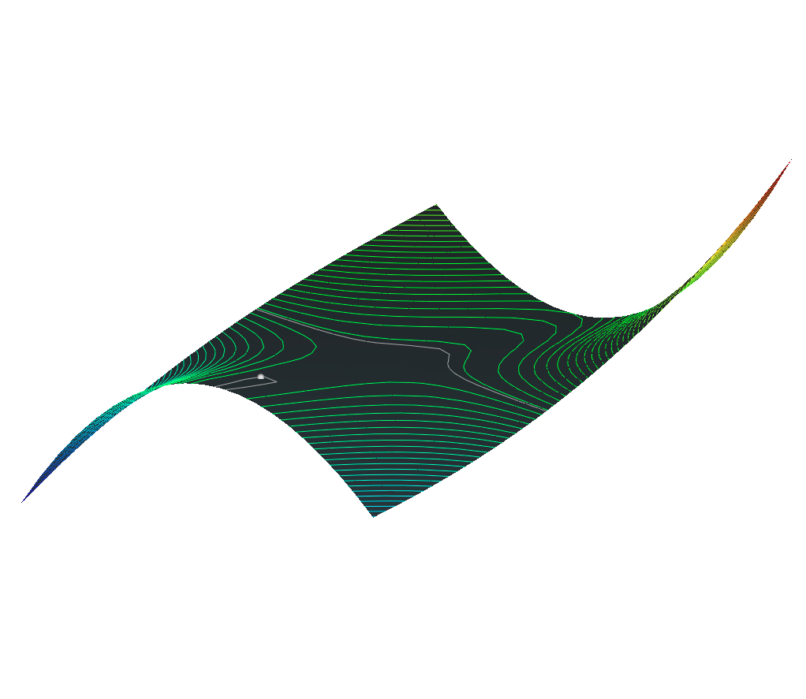

# Project 2  
Scientific Visualizations  
Charles Ison  
10/20/2022
GitHub Link (for ReadMe markdown formatting): https://github.com/charles-ison/sv_project_2

1. a.) 

$$\nabla f(x, y) = 
\begin{pmatrix}
\frac{\partial f}{\partial x} \\
\frac{\partial f}{\partial y}
\end{pmatrix} =
\begin{pmatrix}
\ 3x^2 - 12xy + 3y^2 - 3 \\
\ -6x^2 + 6xy - 3y^2 + 3
\end{pmatrix}
$$

 

$$\texttt{Get critical points by setting both partial derivates equal to zero and solving: }$$ 

$$ 3(x^2 - 4xy + y^2 - 1) = 0 \texttt{ and } -3(2x^2 - 2xy + y^2 - 1) = 0 $$

 

$$\texttt{Critical Points: }$$

$$ (0, -1), \texttt{ } (0, 1), \texttt{ } (\frac{-2}{\sqrt{13}}, \frac{1}{\sqrt{13}}), \texttt{ } (\frac{2}{\sqrt{13}}, \frac{-1}{\sqrt{13}})$$

1. b.) 

$$H_f = 
\begin{pmatrix}
\frac{\partial^2 z}{\partial x^2} & \frac{\partial^2 z}{\partial x \partial y} \\
\frac{\partial^2 z}{\partial y \partial x} & \frac{\partial^2 z}{\partial y^2}
\end{pmatrix} =
\begin{pmatrix}
\ 6x - 12y & -12x + 6y \\
\ -12x + 6y & 6x - 6y
\end{pmatrix}
$$

 

$$\texttt{For critical point: } (0, -1) \rightarrow 
\begin{pmatrix}
\ 12 & -6 \\
\ -6 & 6
\end{pmatrix}
\rightarrow \lambda	= \frac{18 \pm \sqrt{180}}{2} = 9 \pm 3\sqrt{5} 
$$

$$\texttt{Both eigenvalues are positive, so (0, -1) is a local minimum.}$$

 

$$\texttt{For critical point: } (0, 1) \rightarrow 
\begin{pmatrix}
\ -12 & 6 \\
\ 6 & -6
\end{pmatrix}
\rightarrow \lambda	= \frac{-18 \pm \sqrt{180}}{2} = -9 \pm 3\sqrt{5} 
$$

$$\texttt{Both eigenvalues are negative, so (0, 1) is a local maximum.}$$

 

$$\texttt{For critical point: } (\frac{-2}{\sqrt{13}}, \frac{1}{\sqrt{13}}) \rightarrow 
\begin{pmatrix}
\frac{-24}{\sqrt{13}} & \frac{30}{\sqrt{13}} \\
\frac{30}{\sqrt{13}} & \frac{-18}{\sqrt{13}}
\end{pmatrix}
\rightarrow \lambda = 3(\frac{-7 \pm \sqrt{101}}{\sqrt{13}})
$$

$$\texttt{One eigenvalue is positive and one is negative, so } (\frac{-2}{\sqrt{13}}, \frac{1}{\sqrt{13}}) \texttt{ is a saddle.}$$

 

$$\texttt{For critical point: } (\frac{2}{\sqrt{13}}, \frac{-1}{\sqrt{13}}) \rightarrow 
\begin{pmatrix}
\frac{24}{\sqrt{13}} & \frac{-30}{\sqrt{13}} \\
\frac{-30}{\sqrt{13}} & \frac{18}{\sqrt{13}}
\end{pmatrix}
\rightarrow \lambda = 3(\frac{7 \pm \sqrt{101}}{\sqrt{13}})
$$

$$\texttt{One eigenvalue is positive and one is negative, so } (\frac{2}{\sqrt{13}}, \frac{-1}{\sqrt{13}}) \texttt{ is a saddle.}$$

### Running The Program
* Project was compiled and tested using VisualStudio on the machines in the Kelly computer lab  
* To run part 2.a. use the 'a' button (draws 2D contours for one color)
* To run part 2.b. use the 'b' button (draws 2D contours for multiple colors)
* To run part 2.c. use the 'c' button (draws 3D contours for one color)
* To run part 2.d use the 'd' button (draws 3D contours for multiple colors)
* To run part 3.a use the 'e' button (draws critical points for 2D and 3D contours)
* To run part 3.b use the 'f' button (draws contour lines containing a critical point in either 2D or 3D depending one what the shape already is)
* To flatten the polyhedron use 'g' button
* To clear all polylines use the 'h' button

### Critical Point Key
* Blue is a minimum
* Red is a maximum
* Grey is a saddle

### Question Answers
2.a.) Comparing contour lines vs the project 1 methods of color and height, I feel very similar info is conveyed with the two approaches, but with some suble differences. First, I feel the the contours can review more subtle shape info and reveal with greater accuracy where exactly the key features like a valley exist. This is evident when looking at the two color version of R2 vs the one color contour version of R2 included at the bottom of the file. At the same time, I feel the contours are not as immediately understandable as the color and height visualizations combined from project 1 and improve immensely when height is added in later parts of this project.

2.b.) I think this improves upon 2a, as it gives two mediums that are conveying the same information. I feel this makes the visualization easier to comprehend and more robust than just the one color version. Both of these can be compared below for any of the PLY files.

2.c.) Adding the height to the single color contours makes the vizualization more intuitive as they both convey the same information, but through two different techniques that complement each other. It is also possible to view the heights in two different ways, the first is to keep the polyhedron flat, and the second is to change both the polyhedron's height and the contour's heights. I've added an example of the flattened polyhedron below, and used the format where both have their heights changed for all my PLY file screenshots. I think both look good, perhaps having the flattened polyhedron provides a nice base, whereas the shaped polyhedron gives supplementary info about the shaped contours.

  

2.d.) I believe adding the height on top of the multi colors and contours further improves the visualization. It would be possible adding all of these elements to convey the same information could risk overwhelming the viewer, but this in this case I feel they work well together and complement each other's weaknesses.

2.e.) Between projects 1 and 2, we have worked on what I would classify as 4 different methods that can be used to visualize scalar fields. It is then possible to mix and match each of these different techniques for different combinations with unique pros and cons. The first is using just one color to visualize the scalars, while it does communicate information I found this method the most lacking on its own due to a lack of detail around where key features exist like critical points. After that was adding multiple colors, which I believe greatly enhanced the single color approach by allowing a wider range of scalar values to be communicated in a simple and intuitive manner. Next is using the height to visualize scalar values, which I found to be the most intuitive and easiest to comprehend while also making evident key features like critical points. Finally there are contour values which I believe convey the most specific and detailed information, but are perhaps slightly less intuitive than previously discussed methods. If I were to pick my favorite combination of these, it would be the multi-color contours with their height also shown. 

3.a.) One point on my code for extracting critical points, I found the saddle points found to be extremely sensitive to the size of the threshold used when checking if the point found through taking the partial derivative of the linear interpolation forumla was within a quad. I tried values raning from 0.001 to 0.2 and found I could get different number of saddle points at many different values in this range. The minimum and maximums were much more robust.

3.b.) I found the contour lines containing the critical points to be interesting to look at, but I am not sure if they provided extra value in terms of sharing new information. There are no contour lines for the minimums and maximums, and for the saddle lines I was not able to draw the exact contour lines at the scale of the critical point. This is because we do not know the scalar value of the true critical point, but only its linear interpolation which could be a bit off. The location of the saddle point contour lines could already be inferred using the normal contour lines as well.

### R2
* 100 sub intervals
* R2 One Color:

 

* R2 Multi-Color:

  

* R2 Height + One Color:

    

* R2 Height + Multi-Color:

   
  
* R2 Critical Points:

    
  
* R2 Contour Lines Containing Critical Points:

     
  
### R4
* 100 sub intervals
* R4 One Color:

 

* R4 Multi-Color:

  

* R4 Height + One Color:

    

* R4 Height + Multi-Color:

   
  
* R4 Critical Points:

    

* R4 Contour Lines Containing Critical Points:

  

### R9
* 50 sub intervals
* R9 One Color:

 

* R9 Multi-Color:

  

* R9 Height + One Color:

    

* R9 Height + Multi-Color:

   
  
* R9 Critical Points:

    
  
* R9 Contour Lines Containing Critical Points:

  

### R10
* 50 sub intervals
* R10 One Color:

 

* R10 Multi-Color:

  

* R10 Height + One Color:

    

* R10 Height + Multi-Color:

   
  
* R10 Critical Points:

    

* R10 Contour Lines Containing Critical Points:

  

### R11
* 50 sub intervals
* R11 One Color:

 

* R11 Multi-Color:

  

* R11 Height + One Color:

    

* R11 Height + Multi-Color:

   
  
* R11 Critical Points:

    
  
* R11 Contour Lines Containing Critical Points:

  

### R12
* 50 sub intervals
* R12 One Color:

 

* R12 Multi-Color:

  

* R12 Height + One Color:

    

* R12 Height + Multi-Color:

   
  
* R12 Critical Points:

   
  
* R12 Contour Lines Containing Critical Points:

  

### R13
* 50 sub intervals
* R13 One Color:

 

* R13 Multi-Color:

  

* R13 Height + One Color:

    

* R13 Height + Multi-Color:

   
  
* R13 Critical Points:

   
  
* R13 Contour Lines Containing Critical Points:

  

### R14
* 50 sub intervals
* R14 One Color:

 

* R14 Multi-Color:

  

* R14 Height + One Color:

    

* R14 Height + Multi-Color:

   
  
* R14 Critical Points:

   
  
* R14 Contour Lines Containing Critical Points:

  
